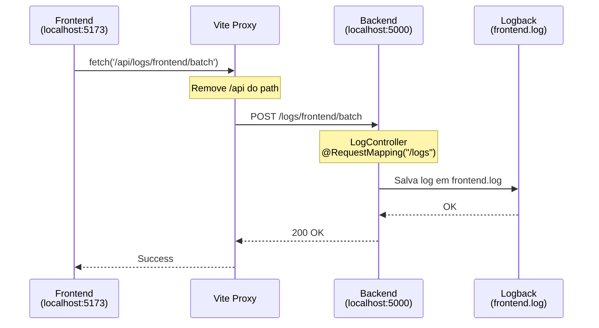

# 🔄 Arquitetura de Comunicação Frontend ↔ Backend

## 📊 **Fluxo Completo**

```
┌─────────────────────────────────────────────────────────────────────┐
│                         FRONTEND (Vite)                              │
│                      http://localhost:5173                           │
└─────────────────────────────────────────────────────────────────────┘
                                  │
                                  │ fetch('/api/...')
                                  ▼
┌─────────────────────────────────────────────────────────────────────┐
│                      VITE PROXY (Dev Only)                           │
│  • Intercepta requisições que começam com /api                      │
│  • Remove /api do caminho                                            │
│  • Encaminha para http://localhost:5000                             │
└─────────────────────────────────────────────────────────────────────┘
                                  │
                                  │ HTTP Request
                                  ▼
┌─────────────────────────────────────────────────────────────────────┐
│                      BACKEND (Spring Boot)                           │
│                      http://localhost:5000                           │
└─────────────────────────────────────────────────────────────────────┘
```

---

## ✅ **Rotas que FUNCIONAVAM (Antes)**

### **1. Cadastro de Cliente**

| Camada | Path/Config | Resultado |
|--------|-------------|-----------|
| **Frontend** | `fetch('/api/clientes')` | Usa API_BASE_URL = `/api` |
| **Proxy Vite** | Remove `/api` | ➜ `http://localhost:5000/clientes` |
| **Backend** | `@PostMapping("/clientes")` | ✅ Match! |

**Controller:**
```java
@RestController  // SEM @RequestMapping
public class ClienteController {
    @PostMapping("/clientes")
}
```

### **2. Login**

| Camada | Path/Config | Resultado |
|--------|-------------|-----------|
| **Frontend** | `fetch('/api/login')` | API_BASE_URL + `/login` |
| **Proxy Vite** | Remove `/api` | ➜ `http://localhost:5000/login` |
| **Backend** | `@GetMapping("/login")` | ✅ Match! |

---

## ❌ **Rota que NÃO FUNCIONAVA (Antes)**

### **3. Logs do Frontend**

| Camada | Path/Config | Resultado |
|--------|-------------|-----------|
| **Frontend** | `fetch('/api/logs/frontend/batch')` | Logger usa backendUrl |
| **Proxy Vite** | Remove `/api` | ➜ `http://localhost:5000/logs/frontend/batch` |
| **Backend (ANTES)** | `@RequestMapping("/api/logs")` | ❌ Esperava `/api/logs/...` |

**Erro:**
```
❌ Backend espera: /api/logs/frontend/batch
❌ Backend recebe:  /logs/frontend/batch
```

---

## ✅ **CORREÇÃO APLICADA**

### **Backend - LogController.java**

**ANTES (❌ Inconsistente):**
```java
@RestController
@RequestMapping("/api/logs")  // ❌ Tinha /api
public class LogController {
    @PostMapping("/frontend/batch")
    // Endpoint completo: /api/logs/frontend/batch
}
```

**DEPOIS (✅ Consistente):**
```java
@RestController
@RequestMapping("/logs")  // ✅ Sem /api (padrão dos outros controllers)
public class LogController {
    @PostMapping("/frontend/batch")
    // Endpoint completo: /logs/frontend/batch
}
```

### **Frontend - logger.js**

**Configuração atual:**
```javascript
// Em DEV, usa proxy do Vite
this.backendUrl = import.meta.env.DEV 
    ? ''  // Usa proxy (mesma origem)
    : 'http://localhost:5000'  // Em PROD
```

---

## 🔄 **Fluxo Atualizado - Logs Agora Funcionam!**

| Camada | Path/Config | Resultado |
|--------|-------------|-----------|
| **Frontend** | `fetch('/api/logs/frontend/batch')` | backendUrl = '' em DEV |
| **Proxy Vite** | Remove `/api` | ➜ `http://localhost:5000/logs/frontend/batch` |
| **Backend** | `@RequestMapping("/logs")` | ✅ Match! |

---

## 📋 **Resumo da Arquitetura**

### **Desenvolvimento (DEV)**
```javascript
// Frontend (main.js)
const API_BASE_URL = '/api'  // Usa proxy

// Todas as requisições
fetch('/api/clientes')        → Proxy → http://localhost:5000/clientes
fetch('/api/login')           → Proxy → http://localhost:5000/login
fetch('/api/logs/...')        → Proxy → http://localhost:5000/logs/...
```

**Benefícios do Proxy em DEV:**
- ✅ Sem CORS (mesma origem)
- ✅ Sem configuração de CORS no backend
- ✅ Simula comportamento de produção

### **Produção (PROD)**
```javascript
// Frontend (main.js)
const API_BASE_URL = 'http://localhost:5000'  // URL completa

// Todas as requisições diretas
fetch('http://localhost:5000/clientes')
fetch('http://localhost:5000/login')
fetch('http://localhost:5000/logs/...')
```

**Requisitos em PROD:**
- ⚙️ CORS configurado no backend (CorsConfig.java)
- 🌐 URL do backend configurável (.env)

---

## 🎯 **Padrão dos Controllers**

### ✅ **Padrão Correto (Todos os Controllers)**

```java
@RestController
// SEM prefixo /api no @RequestMapping
public class ClienteController {
    @PostMapping("/clientes")
}

@RestController
@RequestMapping("/logs")  // ← Sem /api
public class LogController {
    @PostMapping("/frontend/batch")
}
```

### ⚠️ **Exceção (HelloController)**

```java
@RestController
@RequestMapping("/api")  // ← Tem /api (endpoints de teste)
public class HelloController {
    @GetMapping("/hello")  // → /api/hello
}
```

**Por quê?** Para acessar diretamente em testes sem proxy:
- `http://localhost:5000/api/hello` ✅
- Frontend não usa esses endpoints em produção

---

## 🧪 **Como Testar**

### **1. Verificar se o backend reiniciou:**
```powershell
# Verificar logs do backend
Get-Content .\Infra\logs\spring-boot\backend.log -Tail 20
```

### **2. Testar no navegador:**
```javascript
// Abrir console do navegador (F12)

// Teste de cadastro (deve funcionar)
fetch('/api/clientes', {
  method: 'POST',
  headers: { 'Content-Type': 'application/json' },
  body: JSON.stringify({
    PrimeiroNome: "Teste",
    UltimoNome: "Funciona",
    Usuario: "teste@email.com",
    Senha: "1234",
    Cidade: "São Paulo",
    Estado: "SP"
  })
}).then(r => r.json()).then(console.log)

// Logs devem aparecer automaticamente em:
// Infra/logs/spring-boot/frontend.log
```

### **3. Verificar logs do frontend:**
```powershell
# Windows PowerShell
Get-Content .\Infra\logs\spring-boot\frontend.log -Wait
```

---

## 🎨 **Diagrama de Sequência**



---

## ✅ **Checklist de Funcionamento**

- [x] ClienteController sem `/api` no RequestMapping
- [x] LogController sem `/api` no RequestMapping (CORRIGIDO)
- [x] Proxy do Vite remove `/api` em DEV
- [x] API_BASE_URL = `/api` em DEV
- [x] Logger usa backendUrl vazio em DEV
- [x] CORS configurado para produção
- [ ] Backend reiniciado com as mudanças
- [ ] Logs aparecem em `frontend.log`
